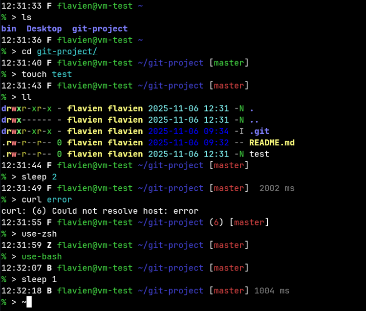
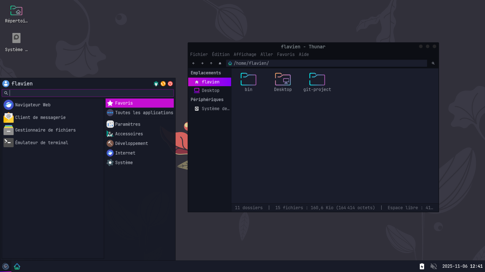
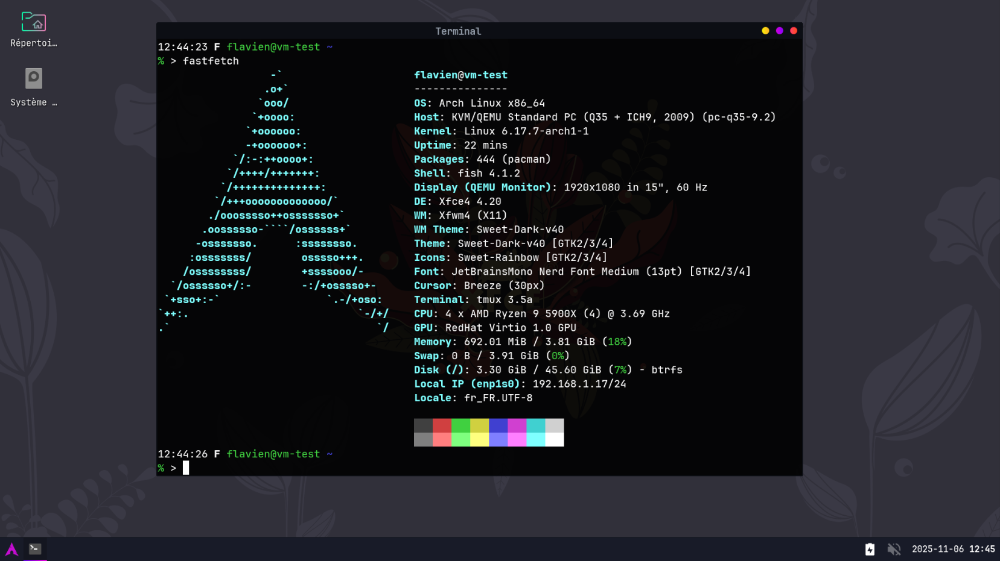

# Linux Configuration

## 1) `shell.sh` — User shell configuration



This script installs base tools and configures the three shells `bash`, `zsh`, and `fish` to provide a consistent prompt.

- Main features
    - provide a consistent prompt (time, active shell, user@host, current directory, Git branch with clean/dirty status, duration of last command if > 250 ms, and non‑zero exit code).
    - Detects the package manager (`apt-get`, `yum`, `dnf`, `apk`, `pacman`) and quietly installs tools :
        - [zsh](https://sourceforge.net/p/zsh/code/ci/master/tree/)
        - [fish](https://fishshell.com/)
        - [git](https://git-scm.com/)
        - [htop](https://htop.dev/)
        - [neovim](https://neovim.io/)
        - [tree](https://linux.die.net/man/1/tree)
        - [eza](https://github.com/eza-community/eza)
        - [ripgrp](https://github.com/BurntSushi/ripgrep)
        - [fd](https://github.com/sharkdp/fd)
        - [bat](https://github.com/sharkdp/bat)
        - [dust](https://github.com/bootandy/dust)
    - Installs user utilities in `~/bin` when not root (auto-detects architecture x86_64/arm64/arm) :
        - [kubectl](https://kubernetes.io/fr/docs/reference/kubectl/)
        - [kubectx](https://github.com/ahmetb/kubectx)
        - [kubens](https://github.com/ahmetb/kubectx)
        - [kompose](https://kompose.io/)
    - Installs the Zsh plugin manager [`zsh-snap`](https://github.com/marlonrichert/zsh-snap) and enables :
      - [zsh-autosuggestions](https://github.com/zsh-users/zsh-autosuggestions)
      - [zsh-syntax-highlighting](https://github.com/zsh-users/zsh-syntax-highlighting)
    - Generates configs for `~/.bashrc`, `~/.zshrc`, `~/.config/fish/config.fish`, and `~/.config/nvim/init.vim`.
    - Creates an `~/.alias` file with useful aliases (`ls/ll` via `eza` if present, `vi` -> `nvim` if present, colored `grep`, etc.).
    - Optionally updates users’ default shell (prefers `fish`, otherwise `zsh`) when possible.
    - Supports running as root (configures all users in `/home`, `root`, and `/etc/skel`) or unprivileged (configures only the current user).

- Requirements
    - Internet access.
    - To run without root: `curl`, `git`, and `awk` must be available.

- Usage
    - Recommended install (all users, requires sudo/root):
      ```sh
      curl -s https://sh.flavien.io/shell.sh | sudo sh -
      ```
    - Local run (from the cloned repo):
      ```sh
      sudo ./shell.sh
      # or for current user only (no sudo; requires curl+git+awk)
      ./shell.sh
      ```

## 2) `xfce.sh` — XFCE themes, fonts, and settings (plus Sway/Tmux)



This script downloads and applies a full customization for an XFCE environment, with optional settings for Sway and tmux when available.

- Main features
    - Fonts: [JetBrainsMono](https://www.jetbrains.com/lp/mono/) with [Nerd Font](https://www.nerdfonts.com/).
    - Icons: [Sweet-Rainbow](https://github.com/EliverLara/Sweet-folders) and [Papirus](https://github.com/PapirusDevelopmentTeam/papirus-icon-theme).
    - Cursor: [Breeze cursors](https://github.com/KDE/breeze).
    - Theme: [Sweet-Dark](https://github.com/EliverLara/Sweet).
    - XFCE: applies configuration files from this repo (`xfce/xconf/*.xml`).
    - tmux: installs `~/.tmux.conf` if `tmux` is available.
    - Sway: installs `~/.config/sway/config` and `config.d/{keyboard,theme}` if `sway` is available.

- Requirements
    - Internet access.
    - Tools: `wget`, `curl`, `unzip`, `xz`.

- Usage
    - For the current user’s home directory:
      ```sh
      curl -s https://sh.flavien.io/xfce.sh | sh -
      ```
    - To prepare a `/etc/skel` skeleton (useful for future users):
      ```sh
      sudo ./xfce.sh /etc/skel
      ```

## 3) `arch.sh` — Automated Arch/Manjaro Linux installation with LUKS + Btrfs + XFCE



Automated installation script for Arch Linux or Manjaro Linux following the "Arch Way". It creates a fully encrypted system with Btrfs subvolumes and a ready-to-use XFCE desktop environment.

- What the script does
    - **Distribution detection**: Automatically detects Arch or Manjaro live environment and adapts the installation process accordingly.
    - **GPT partitioning** of the target disk with `parted`:
        - `p1`: EFI partition (FAT32, 500 MiB)
        - `p2`: Boot partition (ext4, 500 MiB, unencrypted)
        - `p3`: Swap partition (~8 GiB)
        - `p4`: LUKS2-encrypted system (Btrfs, rest of the disk)
    - **LUKS2 encryption** with PBKDF2 + SHA256 on the main partition.
    - **Btrfs subvolumes**: `@` (root), `@home`, `@log`, `@cache` for better snapshots and management.
    - **Base system installation**:
        - Arch: via `pacstrap` with `linux`, `linux-firmware`, `pulseaudio`
        - Manjaro: via `basestrap` with `linux618`, extensive firmware packages, `manjaro-system`, themes, and `manjaro-pipewire`
    - **Desktop environment**: XFCE with LightDM, Sway support, Rio terminal, complete XFCE plugins suite.
    - **Plymouth**: Graphical boot splash screen with encrypted disk password prompt.
    - **Network configuration**: NetworkManager + systemd-resolved with custom DNS (OpenDNS, Cloudflare, FDN).
    - **tmpfs on /tmp**: Temporary files stored in RAM for better performance.
    - **French locale by default**: `fr_FR.UTF-8`, keyboard layout `fr`, timezone `Europe/Paris`.
    - **User creation**: Adds user to the `sudo` group with configured password.
    - **Shell configuration**: Installs `shell.sh` for all users (Bash/Zsh/Fish with custom prompt).
    - **XFCE/Tmux/Sway theming**: Applies configuration to `/etc/skel` via `xfce.sh`.
    - **Additional tools**: tmux, xclip, wl-clipboard, fastfetch, curl, wget, zip/unzip, binutils, and Flatpak.
    - **GRUB bootloader**: Configured with LUKS support, optimal mkinitcpio hooks, and instant boot (timeout=0).

- Architecture features
    - **Modular design**: Script organized in 13 specialized functions for maintainability.
    - **NVMe support**: Automatically detects NVMe drives and adjusts partition naming (p1-p4 vs 1-4).
    - **Error handling**: Uses `set -e` and validates root privileges at startup.
    - **Distribution-specific logic**: Adapts commands (pacstrap/basestrap, genfstab/fstabgen) and packages based on detected distribution.

- Warnings / Requirements
    - **DANGEROUS**: The target disk will be completely erased and repartitioned. Back up all data before running.
    - **Root privileges required**: Script must be run as root.
    - **Compatible with**: Arch Linux installation ISO or Manjaro installation ISO.
    - **Internet connection required**: For package downloads and script fetching.
    - **UEFI system required**: Uses UEFI boot (not legacy BIOS).

- Usage
    - Run from an Arch or Manjaro live session with root privileges:
      ```sh
      # Interactive mode (whiptail dialogs):
      curl -s https://sh.flavien.io/arch.sh | sudo sh -

      # Non-interactive mode (5 arguments):
      # ./arch.sh <HOSTNAME> <DISK> <USERNAME> <PASSWORD> <LUKS_PASSWORD>
      sudo ./arch.sh my-host /dev/sda alice "MyStrongPassword" "MyLuksPassword"
      ```

